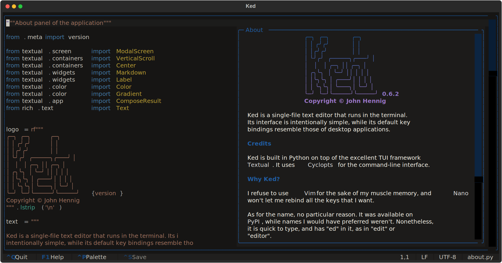

# Ked
*Simple text editor for the terminal*

Ked is a single-file text editor that runs in the terminal. Its interface is
intentionally simple, while its default key bindings resemble those of desktop
applications.




## Installation

Install the application with the [UV] package manager:
```
uv tool install Ked
```

There are other ways to install the app, such as via [PipX] or even just [Pip].
But UV is recommended as it isolates and manages all dependencies, including
Python.

[UV]:   https://docs.astral.sh/uv
[PipX]: https://pipx.pypa.io
[Pip]:  https://pip.pypa.io


## Usage

Simply run
```
ked some_file.txt
```

to edit a file. Run `ked --help` to list further command-line options. Press
<kbd>F1</kbd> in the app for help on interactive usage.


## Development

Debugging a TUI application can be tricky as the user interface blocks the
terminal. But it is often sufficient to look at log output. As explained [in
the Textual documentation][textual-log], open a second terminal session and in
it, start the Textual development console with:
```
uv run textual console --exclude SYSTEM --exclude EVENT --exclude DEBUG
```

In the original terminal, run the app via Textual with:
```
uv run textual run --dev ked:cli some_file.txt
```

The output from `self.log` inside Textual widgets will then appear in the
development console. The `uv run` part of the commands can be left out if the
virtual dev environment has been activated. More verbosity can be achieved by
not suppressing certain message categories in the `textual console` command.

[textual-log]: https://textual.textualize.io/guide/devtools/#textual-log


[](
    https://pypi.python.org/pypi/Ked)
[](
    https://creativecommons.org/licenses/by-nc-nd/4.0)
